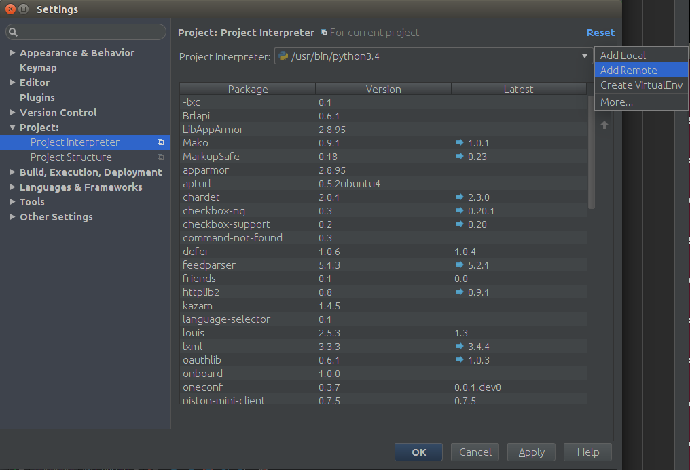
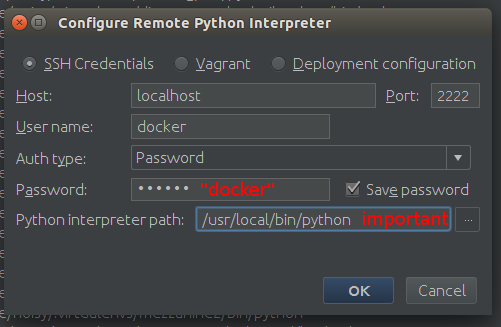
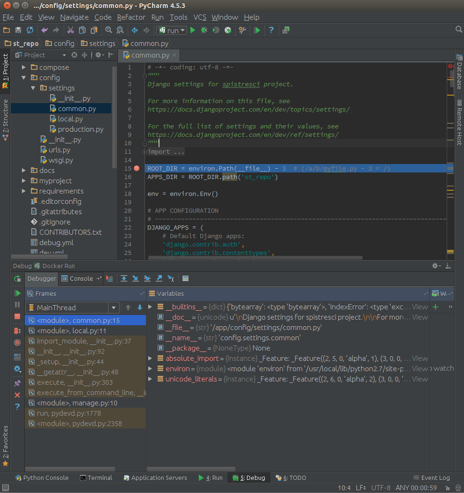

# Run/Debug Configuration (for PyCharm)

## Run debug docker container

To debug python code inside a docker container, you have to first run:

    $ docker-compose -f debug.yml up
    
Container should be ready, when 

    ...
    debug_1    | Starting OpenBSD Secure Shell server: sshd
    ...

will be displayed in docker-compose logs.

## First time configuration

If you haven't configure it yet, enable django support for your project: 

Next, you have to add python intepreter which is inside docker as remote interpreter:

The last thing, you have to properly setup you Run/Debug Configuration. Make sure, that you use host 0.0.0.0.

## How to debug?

Having configuration prepared, simply run your "run" debug configuration: 

