Docker Remote Debugging
=======================

To connect to python remote interpreter, ssh connection has to be established. You may have heard about article |docker-ssh-considered-evil|_

.. _docker-ssh-considered-evil: https://jpetazzo.github.io/2014/06/23/docker-ssh-considered-evil/
.. |docker-ssh-considered-evil| replace:: *If you run SSHD in your Docker containers, you're doing it wrong!*

There is a better tool to login into container if you want to access to shell, i.e. `docker exec`_. However, connecting to remote interpreter is a different thing, much more difficult. You can read more about `attempts on StackOverflow`_.

.. _docker exec: https://docs.docker.com/reference/commandline/exec/
.. _attempts on StackOverflow: http://stackoverflow.com/a/28675525/338581

To avoid putting sshd into production-ready docker image, we create another docker image on top of main ``{{ cookiecutter.repo_name|replace('_', '') }}_django`` image from `compose/debug/Dockerfile <../compose/debug/Dockerfile>`_. That's why you have to first build main `Dockerfile <../Dockerfile>`_, and you can do that by::

    $ docker-compose -f dev.yml build

After that, you can build and run debug container::    

    $ docker-compose -f debug.yml build
    $ docker-compose -f debug.yml up

Container should be ready, when::

    ...
    debug_1    | Starting OpenBSD Secure Shell server: sshd
    ...

will be displayed in docker-compose logs.

You can test ssh conection using password *docker*, by::

    ssh docker_{{ cookiecutter.repo_name }}@localhost -p 2222
    
or you can also use ssh-key::

    ssh -i compose/debug/keys_to_docker/id_rsa docker_{{ cookiecutter.repo_name }}@localhost -p 2222

PyCharm
^^^^^^^

This repository comes with already prepared "Run/Debug Configurations" for docker. 

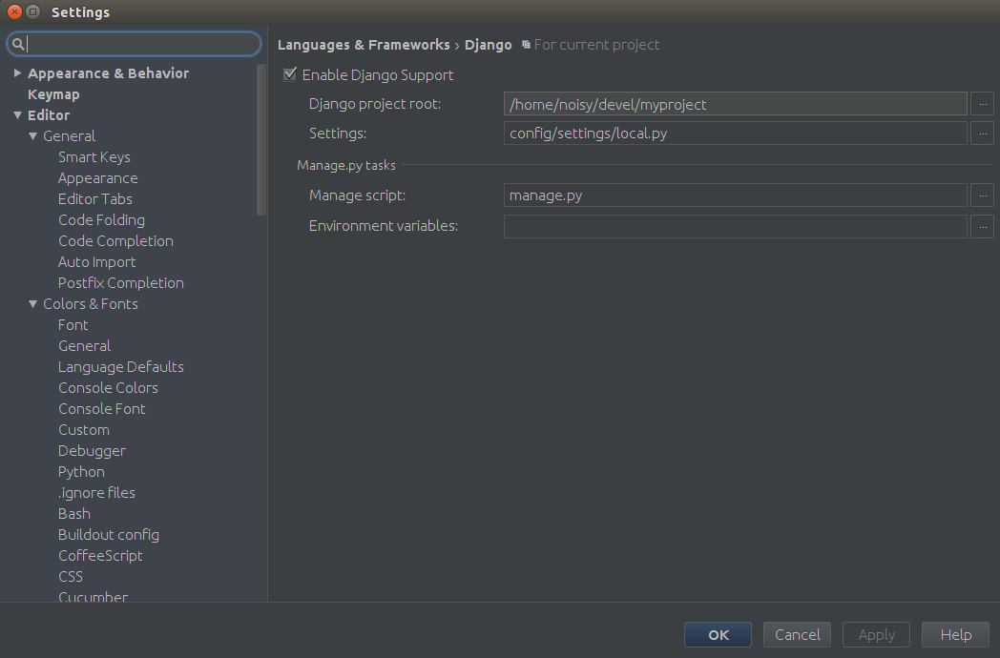

But as you can see, at the beggining there is something wrong with them. They have red X on django icon, and they cannot be used, withot configuring remote python interpteter. To do that, you have to go to *Settings > Build, Execution, Deployment* first.

Even if you tested ssh connection manually, you **have to** do that one more time, through PyCharm, to active "Run/Debug Configurations" for Docker. To do that, please go to *Settings > Build, Execution, Deployment > Deployment > docker_{{ cookiecutter.repo_name }}* and click *Test SFTP connection*:

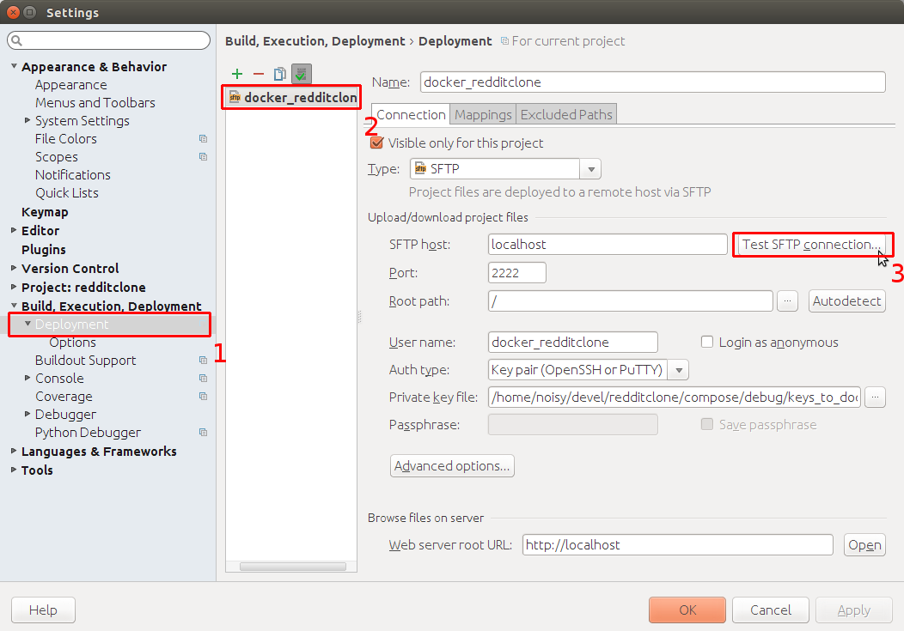

You should see:

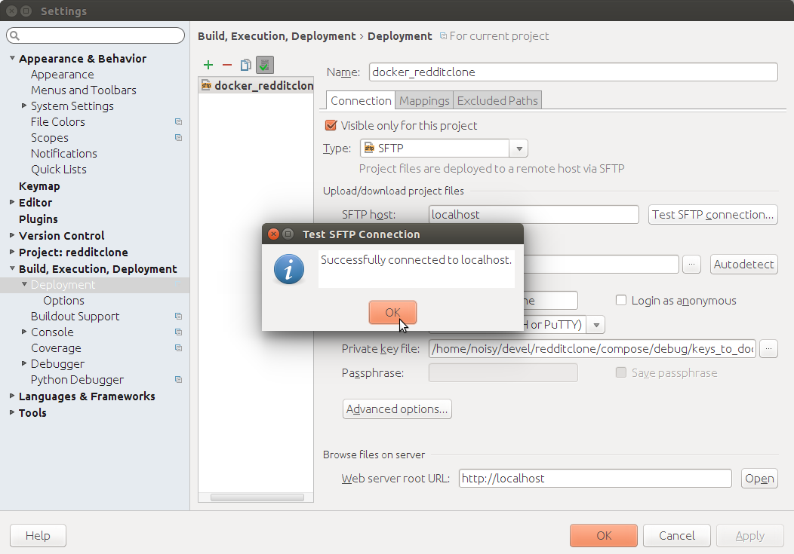

**Important note:** if in the future you will somehow lose ability to login to docker container through PyCharm, always start with *Test SFTP Connection*. Very often this solves all issues.

Configure Remote Python Interpreter
-----------------------------------

Next, you have to add new remote python interpreter, based on already tested deployment settings. Go to *Settings > Project > Project Interpreter*. Click on the cog icon, and click *Add Remote*.

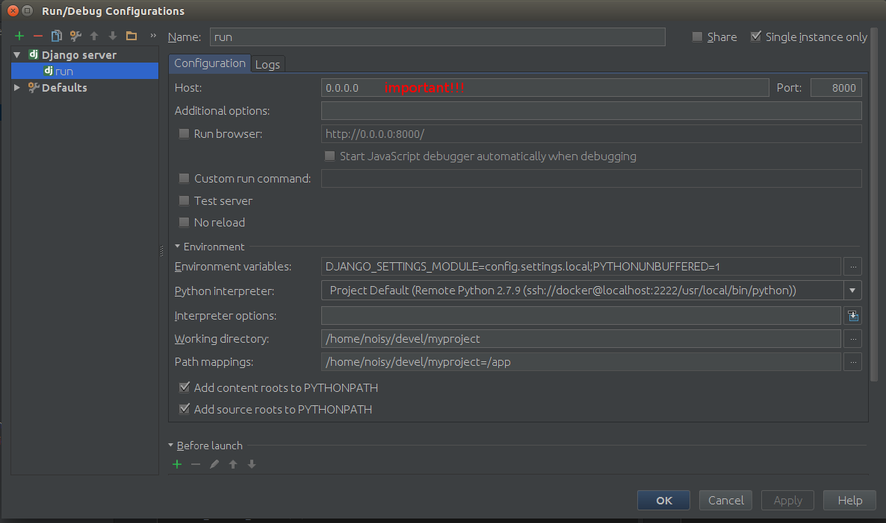

Switch to *Deployment configuration*, and click on *Move this server to application level*. Last, and **very important** thing, change **Python interpreter path**, from `/usr/bin/python` to `/usr/local/bin/python`

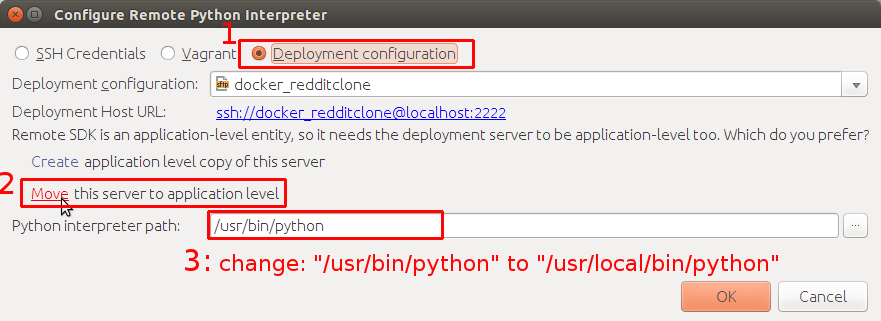

The final result should be:

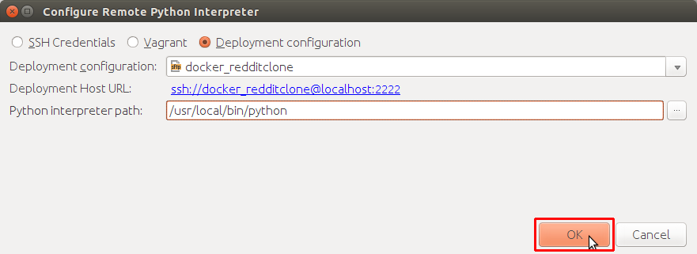

Having that, click *OK*. Close *Settings* panel, and wait few seconds...

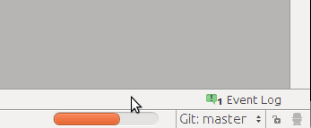

After few seconds, all *Run/Debug Configurations* should be ready to use.

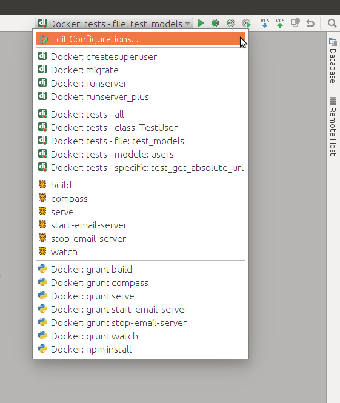

**Things you can do with provided configuration**:

* run and debug python code
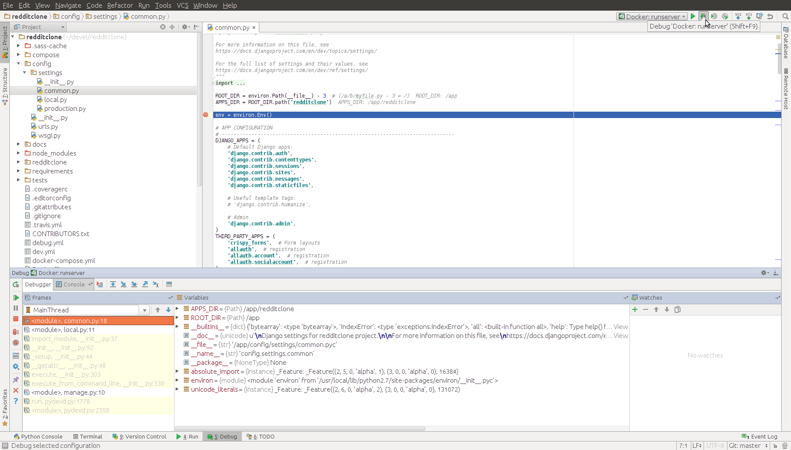
* run migrations
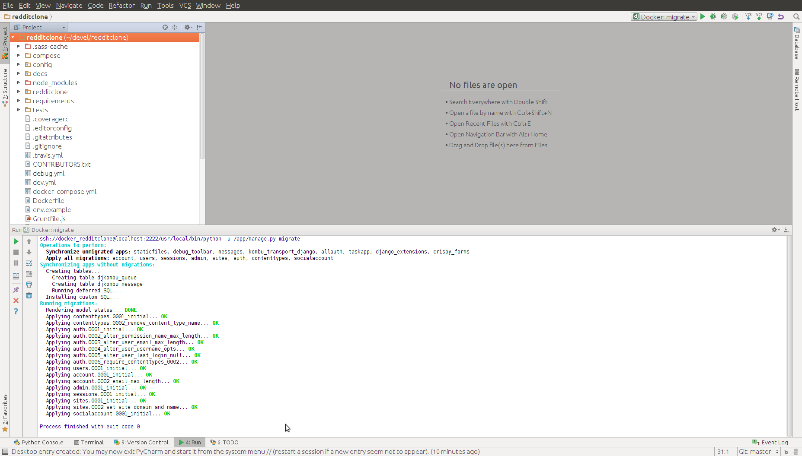
* run tests (with coverage)
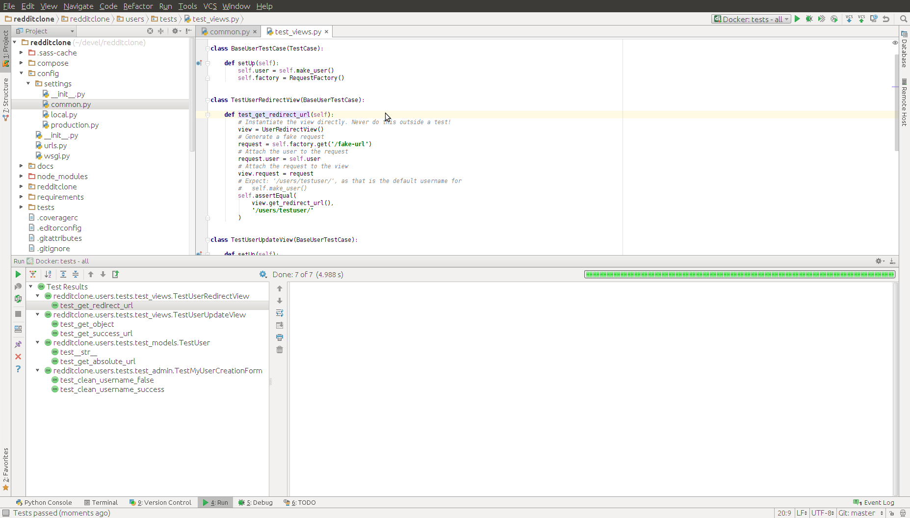
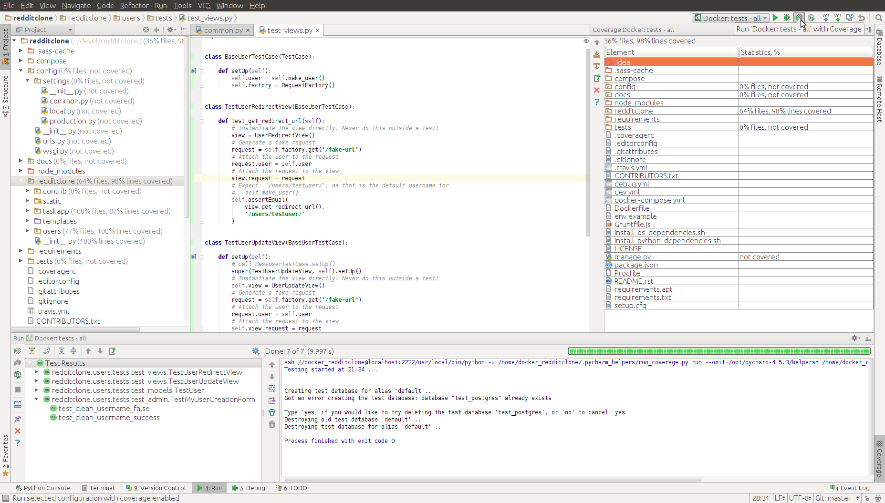
* debug tests
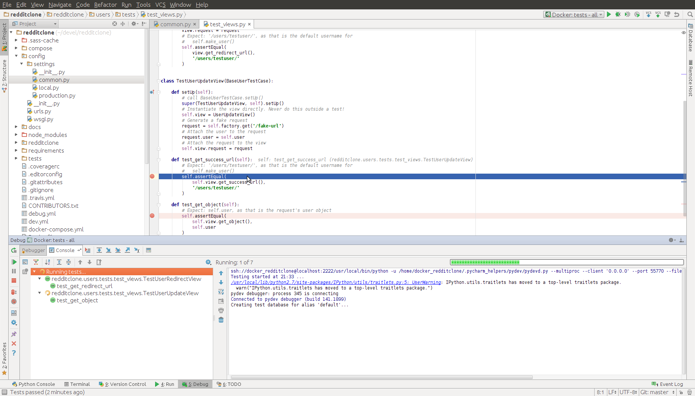
* connect to shell inside docker container
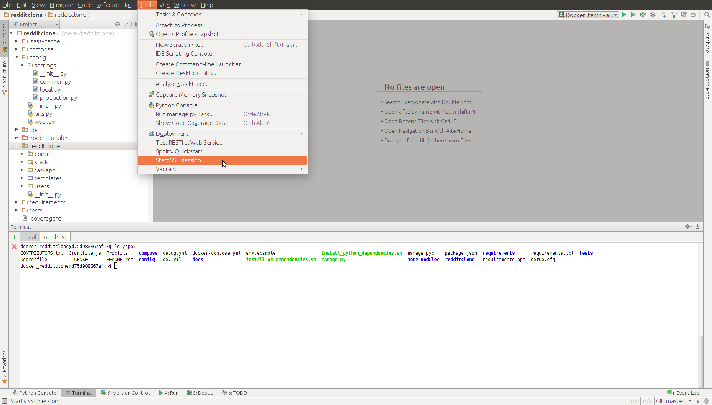
* and many others..

PyCharm Database Configuration
------------------------------

This project also provide a configuration which allow browse project's database from PyCharm (this is enabled only for `docker-compose -f debug.yml up`). 

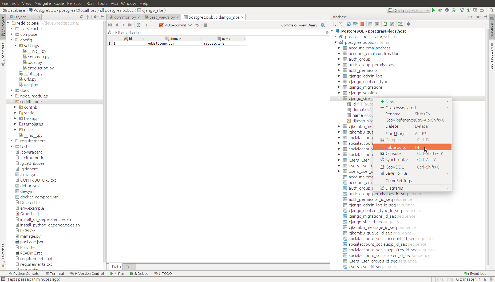

Nevertheless, if you don't have proper driver installer, this will not work. This is how you can install it:

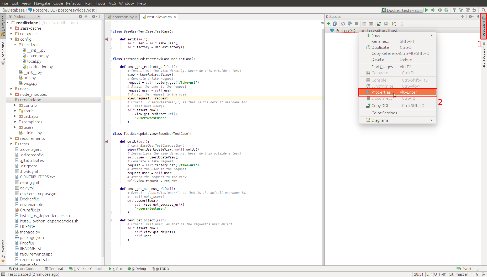
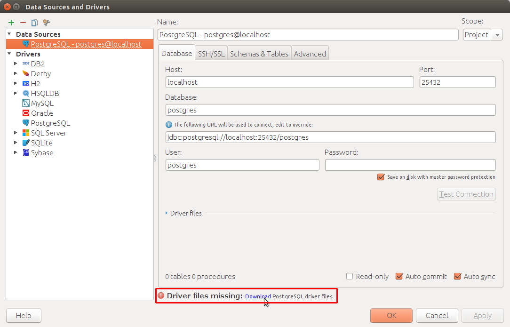

Known issues
------------

Most of the files from `.idea/` were added to `.gitignore` with a few exceptions, which were made, to provide "ready to go" configuration. After adding remote interpreter some of these files are altered by PyCharm:

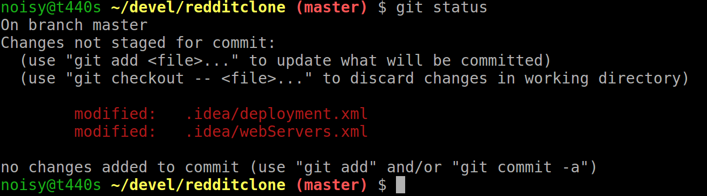

In theory you can remove them from repository, but then, other people will lose a ability to initialize a project from provided configurations as you did. To get rid of this annoying state, you can run command::

    $ git update-index --assume-unchanged .idea/deployment.xml .idea/webServers.xml
